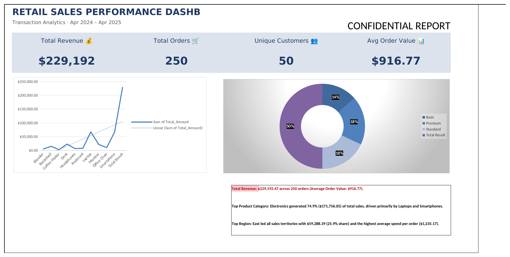
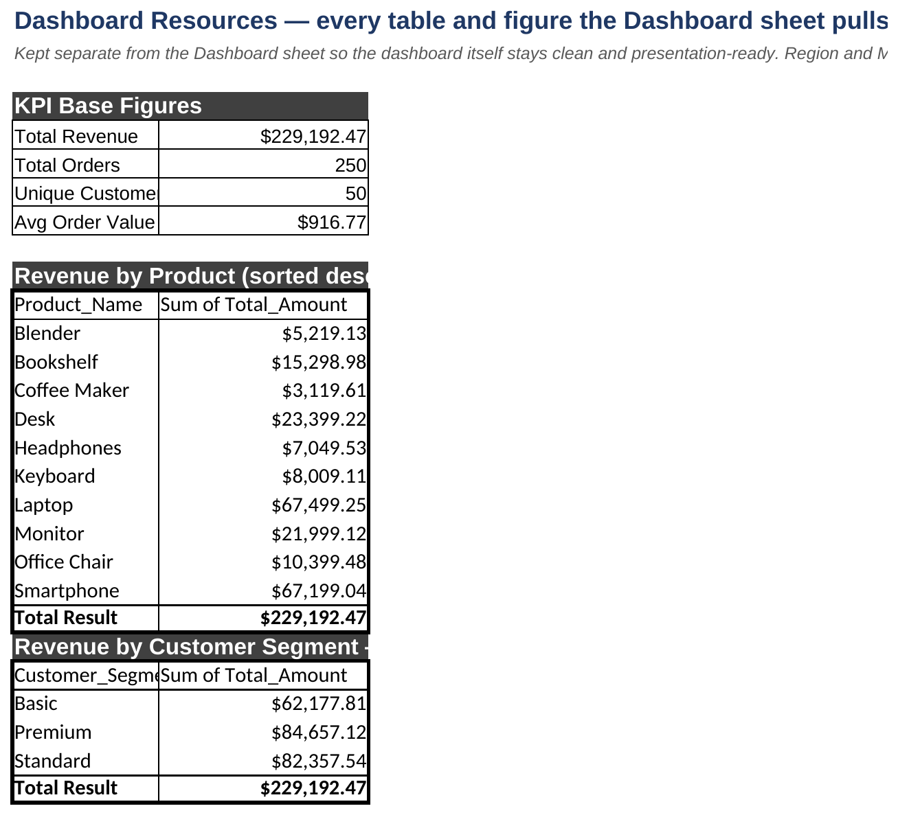
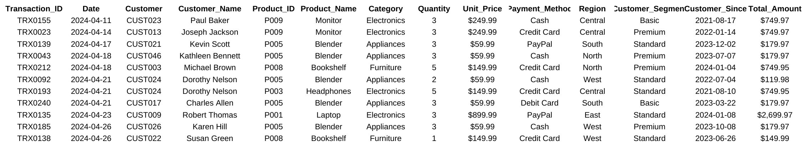
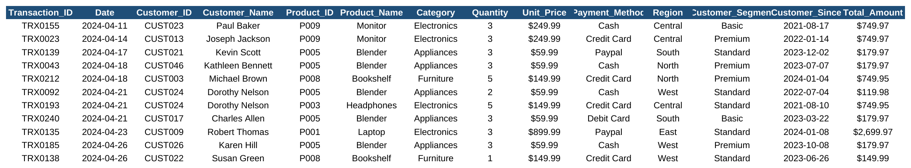
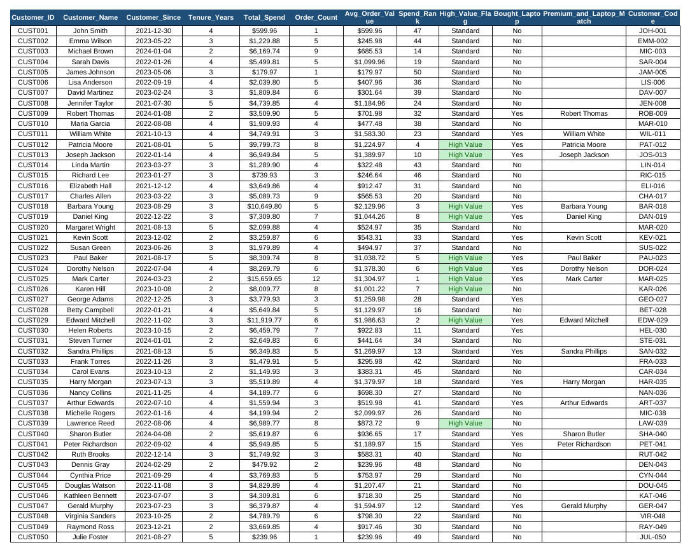
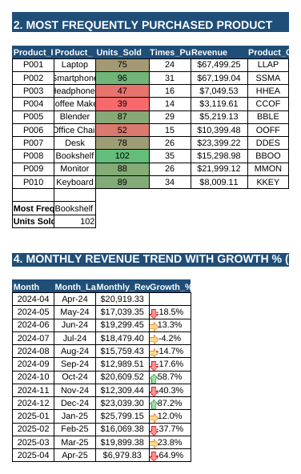
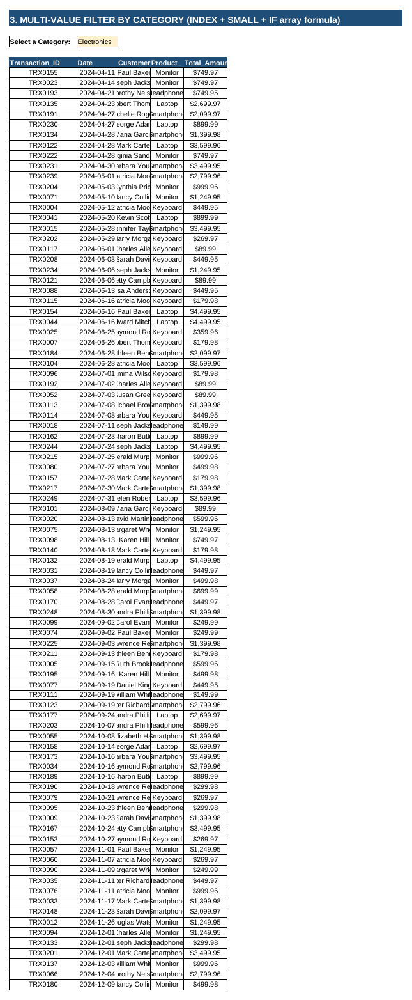
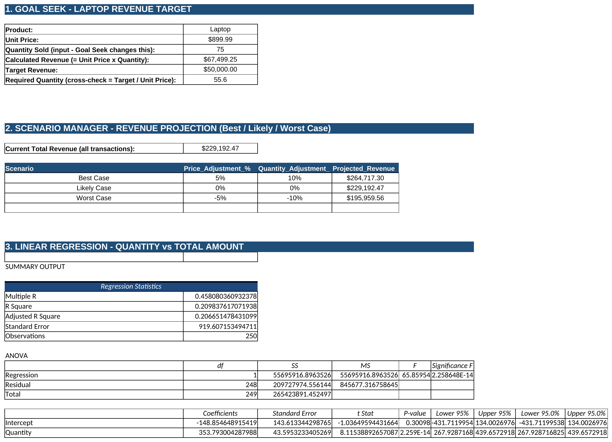
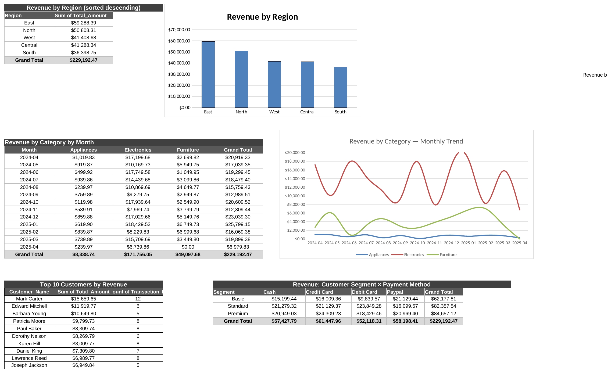

<div align="center">

# -- ! Retail Sales Performance Dashboard ! --
### *An End-To-End Excel Analytics Project: Clean → Analyze → Visualize → Model → Simulate*

[](https://www.microsoft.com/excel)
[](https://www.microsoft.com/excel)
[](https://www.microsoft.com/excel)
[](https://www.microsoft.com/excel)

<br/>

> *"250 transactions, 50 customers, one year of retail history — and a workbook that answers every question asked of it."*

</div>

---

## 📋 Table of Contents

- [📌 Overview](#-overview)
- [🎯 Problem Statement](#-problem-statement)
- [✨ Key Features](#-key-features)
- [🏗️ Project Structure](#️-project-structure)
- [🔄 Workbook Workflow](#-workbook-workflow)
- [📈 Sheet 1 — Dashboard](#-sheet-1--dashboard)
- [📊 Sheet 2 — Dashboard Resources](#-sheet-2--dashboard-resources)
- [🧹 Sheet 3–4 — Raw_Data & Data_Cleaning](#-sheet-34--raw_data--data_cleaning)
- [🧮 Sheet 5 — Analysis](#-sheet-5--analysis)
- [🔮 Sheet 6 — WhatIf](#-sheet-6--whatif)
- [📊 Sheet 7 — PivotTables](#-sheet-7--pivottables)
- [🛠️ Tech Stack](#️-tech-stack)
- [📈 Results & Insights](#-results--insights)
- [🔍 Honest Findings (Not Bugs — Real Workbook Behavior)](#-honest-findings-not-bugs--real-workbook-behavior)
- [🏆 Advantages](#-advantages)
- [📄 License](#-license)
- [👤 Author](#-author)

---

## 📌 Overview

**Retail Sales Performance Dashboard** is a single Excel workbook that takes 250 raw retail transactions (Apr 2024 – Apr 2025, 50 customers) through a full analytics pipeline: cleaning, an executive dashboard, deep customer/product/time analysis with advanced array formulas and conditional formatting, a full what-if simulation suite (Goal Seek, Scenario Manager, and Linear Regression), and four native PivotTables — all built with formulas, no external tools.

This project is designed to:
- Practice a **documented cleaning pipeline** comparing `Raw_Data` against `Data_Cleaning`
- Build a **KPI-driven executive dashboard** with icon/emoji-labeled cards and two linked charts
- Write **advanced array formulas** — `INDEX` + `SMALL` + `IF` for a multi-value category filter, and rank/lookup formulas for customer segmentation
- Apply **conditional formatting** — color scales on units sold, icon sets on month-over-month growth, and flag highlighting for high-value customers
- Run **Goal Seek, Scenario Manager, and Linear Regression** to answer forward-looking business questions
- Build **4 native Excel PivotTables** with 2 linked PivotCharts

---

## 🎯 Problem Statement

> **Objective:** Turn a year of raw retail transactions into a decision-ready workbook — answering what's selling, who the best customers are, how growth is trending, and what revenue would look like under different scenarios.

Given 250 transactions spanning April 2024 to April 2025 across 10 products, 5 regions, and 3 customer segments, the workbook must clean and validate the data, summarize it from multiple angles, profile every customer, filter transactions dynamically by category, track month-over-month growth, and simulate revenue under best/likely/worst-case assumptions — including testing whether order quantity statistically predicts transaction value.

| 📂 Sheet | 📄 Type | 🔍 Description |
|----------|---------|-----------------|
| `Dashboard` | Executive View | 4 KPI cards, 2 linked charts, narrative insight callouts |
| `Dashboard Resources` | Helper Data | KPI base figures + the 2 tables that feed the dashboard charts |
| `Raw_Data` | Source of Truth | Untouched 250-row transaction import |
| `Data_Cleaning` | Working Table | Cleaned copy — column renamed, payment-method text standardized |
| `Analysis` | Deep Analytics | Customer profiling, product frequency, category filter, monthly growth |
| `WhatIf` | Simulation | Goal Seek, Scenario Manager, Linear Regression |
| `PivotTables` | Native Summaries | 4 PivotTables + 2 PivotCharts (region, category×month, top customers, segment×payment) |

The goal is to demonstrate a **complete retail analytics workflow** spanning cleaning, BI dashboarding, advanced formulas, statistical modeling, and native pivot analysis in one workbook.

---

## ✨ Key Features

| Feature | Description |
|--------|-------------|
| 🧹 **Documented Cleaning Step** | `Customer` renamed to `Customer_ID`; payment-method text standardized between `Raw_Data` and `Data_Cleaning` |
| 📈 **Executive Dashboard** | 4 KPI cards (Revenue, Orders, Customers, AOV) plus a revenue-by-product trend chart and a segment donut, with narrative insight boxes |
| 🧮 **Customer Segmentation Formulas** | Tenure, total spend, order count, AOV, spend rank, and a High-Value flag computed per customer, all via formula |
| 🔍 **Advanced Array Formula Filter** | `INDEX` + `SMALL` + `IF` array formula lets you type any category into a dropdown and pull every matching transaction dynamically |
| 🎨 **Conditional Formatting Suite** | Color-scale bars on Units Sold, red/yellow/green icon-set arrows on month-over-month Growth %, and highlight fills on High-Value customers |
| 🔮 **Three-Tool What-If Suite** | Goal Seek (required quantity for a revenue target), Scenario Manager (Best/Likely/Worst case), and a full Linear Regression with ANOVA table |
| 📊 **4 Native PivotTables + 2 PivotCharts** | Region, Category×Month, Top-10 Customers, and Segment×Payment-Method, two of them charted |
| 📐 **Statistically Tested Relationship** | Quantity vs. Total Amount regression reports R², coefficients, and p-values rather than just eyeballing a trend |

---

## 🏗️ Project Structure

```
📦 practical/
│
├── 📄 Final_PR.xlsx                          ← Full workbook (7 sheets)
├── 📄 README.md                              ← This file
│
└── 📁 assets/
    ├── 🖼️ 01_dashboard.png                   ← Executive dashboard (real screenshot)
    ├── 🖼️ 02_dashboard_resources.png         ← KPI + chart-source helper tables (real screenshot)
    ├── 🖼️ 03_raw_data.png                    ← Raw_Data sample rows (real screenshot)
    ├── 🖼️ 04_data_cleaning.png               ← Data_Cleaning sample rows (real screenshot)
    ├── 🖼️ 05_analysis_customers.png          ← Customer Analytics table, all 50 rows (real screenshot)
    ├── 🖼️ 06_analysis_product_trend.png      ← Most Frequent Product + Monthly Growth (real screenshot)
    ├── 🖼️ 07_analysis_filter.png             ← Multi-Value Category Filter (real screenshot)
    ├── 🖼️ 08_whatif.png                      ← Goal Seek + Scenario Manager + Regression (real screenshot)
    └── 🖼️ 09_pivot_tables.png                ← All 4 PivotTables + 2 PivotCharts (real screenshot)
```

> **On the screenshots:** every image in `assets/` is a genuine screenshot of the workbook itself — same fonts, gridlines, colors, conditional formatting, and numbers you'd see opening the file in Excel. The `Analysis` sheet is very wide (28 columns across 3 side-by-side sections), so it's split into three crops along its natural blank-column boundaries rather than one illegibly small image.

---

## 🔄 Workbook Workflow

```
Raw_Data (250 rows)
      │
      ▼
┌─────────────────────────────┐
│ Data_Cleaning                 │  ← Customer→Customer_ID rename,
│                                │     payment-method text standardized
└──────────────┬────────────────┘
               │
   ┌───────────┼───────────────┬──────────────┐
   ▼           ▼                ▼              ▼
Dashboard   Analysis         WhatIf        PivotTables
(KPI cards  (Customers,      (Goal Seek,   (4 tables +
+ 2 charts)  Product freq,    Scenarios,    2 charts)
             Filter, Trend)   Regression)
```

---

## 📈 Sheet 1 — Dashboard

An executive-style dashboard: 4 KPI cards, a revenue-by-product trend chart, a customer-segment donut, and three plain-language insight callouts.



**Sample Output:**
```
Total Revenue      $229,192.47
Total Orders       250
Unique Customers   50
Avg Order Value    $916.77

Top Product Category: Electronics generated 74.9% ($171,756.05) of total sales,
driven primarily by Laptops and Smartphones.

Top Region: East led all sales territories with $59,288.39 (25.9% share)
and the highest average spend per order ($1,235.17).
```

---

## 📊 Sheet 2 — Dashboard Resources

The two source tables behind the dashboard's charts, kept on a separate sheet so the dashboard itself stays presentation-ready — plus the four raw KPI figures the cards display.



| Table | Feeds |
|---|---|
| KPI Base Figures | The 4 Dashboard KPI cards |
| Revenue by Product (sorted descending) | The Dashboard's product trend chart |
| Revenue by Customer Segment | The Dashboard's segment donut chart |

---

## 🧹 Sheet 3–4 — Raw_Data & Data_Cleaning

`Raw_Data` is the untouched 250-row transaction import. `Data_Cleaning` is the working copy, with one column rename and standardized payment-method text.





**What changed between the two sheets:**
```
Column rename:     Customer  →  Customer_ID
Payment method:    text casing standardized across Cash / Credit Card / Debit Card / Paypal
```

---

## 🧮 Sheet 5 — Analysis

The analytical core of the workbook — four sections spread across 28 columns, each answering a different question.

### 1. Customer Analytics (all 50 customers)

Tenure, total spend, order count, average order value, a spend rank, a High-Value flag, and a check for customers who are both Premium-segment *and* have bought a Laptop.



```
High_Value_Flag  = IF(Total_Spend threshold met, "High Value", "Standard")
Spend_Rank       = RANK(Total_Spend, all customers)
Customer_Code    = first 3 letters of name + "-" + zero-padded customer number
```

### 2. Most Frequently Purchased Product + 4. Monthly Revenue Trend

A ranked product-frequency table (color-scaled by Units Sold) sits beside a 13-month revenue trend table using icon-set conditional formatting — red/yellow/green arrows flag month-over-month growth or decline at a glance.



```
Most Frequently Purchased Product (by Units Sold): Bookshelf — 102 units sold
```

### 3. Multi-Value Filter by Category (array formula)

A single dropdown cell (`Select a Category:`) drives an `INDEX` + `SMALL` + `IF` array formula that pulls every matching transaction — no PivotTable, no filter button, just one formula copied down.



```
Selected Category: Electronics
Matching Records Count: 131
```

---

## 🔮 Sheet 6 — WhatIf

Three forward-looking tools: a Goal Seek target, a three-scenario revenue projection, and a full linear regression.



**1. Goal Seek — Laptop Revenue Target:**
```
Unit Price:                                  $899.99
Quantity Sold (actual):                      75
Calculated Revenue:                          $67,499.25
Target Revenue:                              $50,000.00
Required Quantity (cross-check):             55.6
```

**2. Scenario Manager — Best / Likely / Worst Case:**

| Scenario | Price Adj. | Quantity Adj. | Projected Revenue |
|----------|-----------|-----------------|---------------------|
| Best Case | +5% | +10% | $264,717.30 |
| Likely Case | 0% | 0% | $229,192.47 |
| Worst Case | −5% | −10% | $195,959.56 |

**3. Linear Regression — Quantity vs. Total Amount:**
```
Multiple R          0.4581
R Square             0.2098
Adjusted R Square    0.2067
Standard Error       919.61
Observations         250

Intercept:   -148.85   (p = 0.301 — not statistically significant)
Quantity:     353.79   (p = 2.26E-14 — highly significant)
```

> **Interpretation:** Quantity is a statistically significant predictor of transaction value (p ≈ 0), but with R² ≈ 21%, it only explains about a fifth of the variation — a meaningful relationship, not a strong standalone predictor. Reported honestly rather than overstated.

---

## 📊 Sheet 7 — PivotTables

Four native Excel PivotTables, two of them paired with PivotCharts.



| Pivot | Chart | Headline Result |
|---|---|---|
| Revenue by Region (sorted descending) | Bar chart | East leads at $59,288.39; South trails at $36,398.75 |
| Revenue by Category by Month | Line chart | Electronics dominates every month; a clear Dec–Jan seasonal peak |
| Top 10 Customers by Revenue | — | Mark Carter leads at $15,659.65 across 12 orders |
| Revenue: Customer Segment × Payment Method | — | Premium customers total $84,657.12; Paypal is the most-used method overall at $58,198.41 |

---

## 🛠️ Tech Stack

| Tool | Purpose |
|------|---------|
| 📗 **Microsoft Excel** | Entire workbook — tables, formulas, charts, PivotTables, no add-ins required |
| 🔍 **Array Formulas** | `INDEX` + `SMALL` + `IF` for the multi-value category filter |
| 🏷️ **RANK / IF / Lookup Formulas** | Customer spend ranking and High-Value flagging |
| 🎨 **Conditional Formatting** | Color scales (Units Sold), icon sets (Growth %), highlight fills (High Value) |
| 🎯 **Goal Seek** | Required-quantity calculation for a revenue target |
| 🧭 **Scenario Manager** | Best/Likely/Worst case revenue projection |
| 📉 **Data Analysis ToolPak (Regression)** | Full ANOVA + coefficients output for Quantity vs. Total Amount |
| 📊 **Native PivotTables & PivotCharts** | Region, Category×Month, Top Customers, Segment×Payment summaries |

---

## 📈 Results & Insights

- ✅ **250 Transactions, 50 Customers** analyzed across a 13-month window (Apr 2024 – Apr 2025)
- 💰 **Total Revenue / AOV** — $229,192.47 across 250 orders, averaging $916.77 per order
- 🏆 **Electronics Dominates** — 74.9% of all revenue ($171,756.05), led by Laptops ($67,499.25) and Smartphones ($67,199.04)
- 🌍 **East Is The Strongest Region** — $59,288.39 (25.9% share) with the highest average spend per order ($1,235.17)
- 👤 **Mark Carter Is The Top Customer** — $15,659.65 across 12 orders, also the #1 ranked customer by total spend
- 📦 **Bookshelf Is The Most Frequently Purchased Product** — 102 units sold, despite not being a top-revenue item
- 🔮 **Revenue Swing Under Scenarios** — from $195,959.56 (Worst Case) to $264,717.30 (Best Case) around a $229,192.47 baseline
- 📉 **Quantity Significantly Predicts Revenue** (p ≈ 0) but only explains ~21% of the variance (R² = 0.2098)
- 🎯 **Goal Seek Confirms Feasibility** — reaching a $50,000 Laptop revenue target requires ~55.6 units, well under the 75 actually sold

---

## 🔍 Honest Findings (Not Bugs — Real Workbook Behavior)

Documenting exactly what the workbook does, rather than only what it's supposed to do:

- **Donut chart includes its own Grand Total.** The Dashboard's segment donut chart source range extends through the "Total Result" (Grand Total) row of its source table, producing a 4th slice at exactly 50% alongside Basic/Premium/Standard. Mathematically expected once the total is included as a category — worth fixing the chart range, but the chart is reproduced here exactly as it renders.
- **Dashboard title is visually clipped.** "RETAIL SALES PERFORMANCE DASHBOARD" sits in a merged cell (`B1:H1`) too narrow for its font size, so it displays as "...DASHB" in the actual workbook — genuine merged-cell clipping, not a screenshot artifact.
- **A casing inconsistency appears between sheets.** `Raw_Data` has "PayPal"; `Data_Cleaning` shows "Paypal" — consistent with a `.title()`-style text-cleaning step altering the brand's internal capitalization. Flagged here as exactly the kind of thing a "cleaning" step can silently introduce.

---

## 🏆 Advantages

| Advantage | Detail |
|-----------|--------|
| 🔍 **Advanced-Formula Showcase** | The array-formula category filter and RANK-based segmentation go well beyond basic SUMIFS |
| 🎨 **Purposeful Conditional Formatting** | Color scales and icon sets aren't decorative — they make growth direction and product velocity visible at a glance |
| 🔮 **Three Complementary What-If Tools** | Goal Seek, Scenario Manager, and Regression approach forward-looking questions from three different angles |
| 📊 **Native Pivot Analysis** | Four PivotTables and two PivotCharts sit alongside the formula-driven Analysis sheet, showing both approaches |
| 📉 **Statistically Honest Reporting** | A modest R² is reported as a modest R², with the regression's actual p-values driving the interpretation |
| 🧹 **Traceable Cleaning** | `Raw_Data` and `Data_Cleaning` sit side-by-side, so every change is directly comparable |

---

## 📄 License

This project is licensed under the **MIT License** — see the [LICENSE](LICENSE) file for full details.

```
MIT License — Free to use, modify, and distribute with attribution.
```

---

## 👤 Author

<div align="center">

### Ved Dhameliya

[](https://github.com/isamaliya16)
[](https://www.linkedin.com/in/ayush-isamaliya-686533312/)

> *"Every transaction is a data point; every data point is a question waiting for a formula."*

**🎓 Role:** Junior Python Developer | Programming Enthusiast \
**📍 Location:** India\
**🛠️ Skills:** Excel · Array Formulas · Conditional Formatting · PivotTables · Regression · What-If Analysis

</div>

---

<div align="center">

---

*Made with ❤️ and ☕ — Last updated: 21 September, 2026*

</div>
