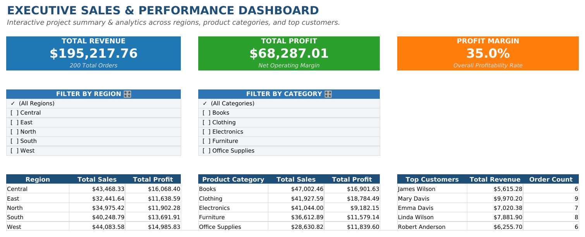
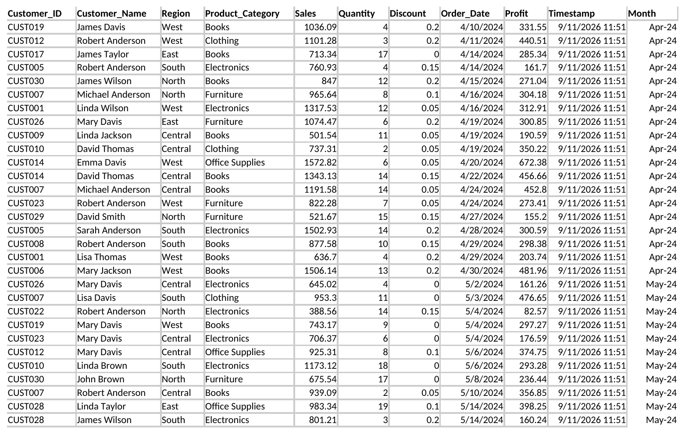
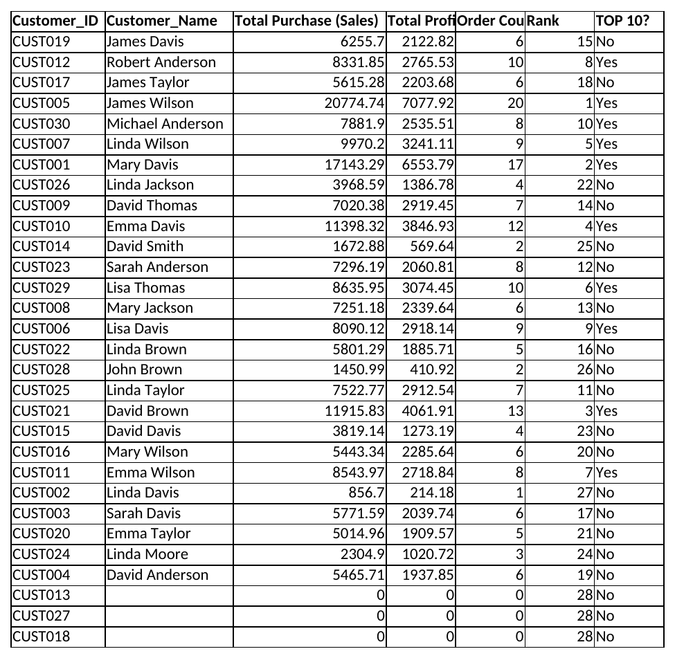
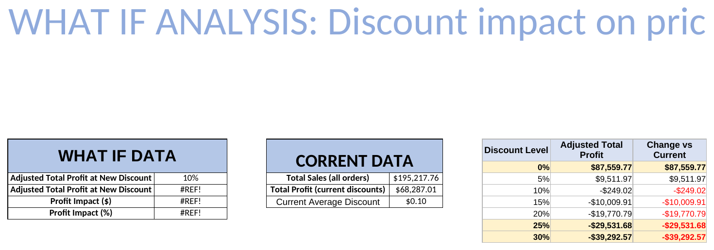
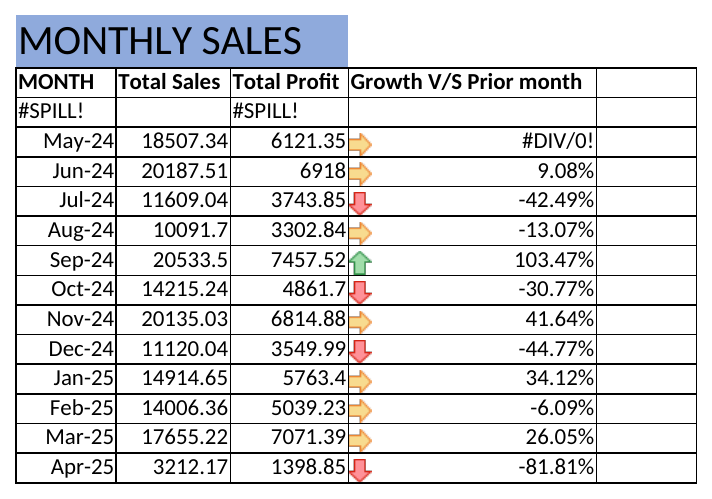
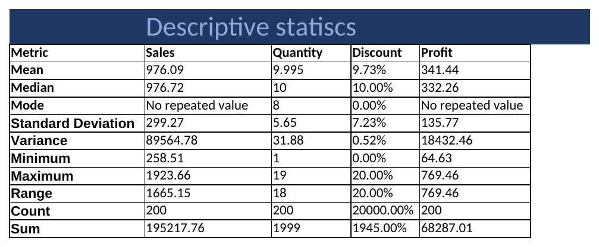
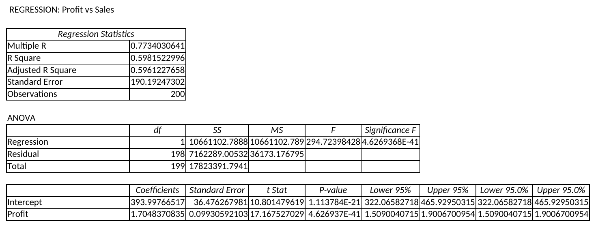
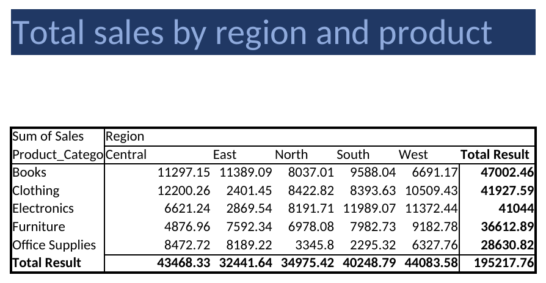

<div align="center">

# -- ! Executive Pulse ! --
### *A Multi-Sheet Excel Sales & Performance Dashboard*

[](https://www.microsoft.com/microsoft-365/excel)
[](https://www.microsoft.com/microsoft-365/excel)
[](https://www.microsoft.com/microsoft-365/excel)
[](https://www.microsoft.com/microsoft-365/excel)

<br/>

> *"A dashboard is a promise that the numbers behind it are telling the truth — this one's worth double-checking."*

</div>

---

## 📋 Table of Contents

- [📌 Overview](#-overview)
- [🎯 Problem Statement](#-problem-statement)
- [✨ Key Features](#-key-features)
- [🏗️ Workbook Structure](#️-workbook-structure)
- [🖼️ Sheet-by-Sheet Walkthrough](#️-sheet-by-sheet-walkthrough)
- [🧠 Formula & Technique Library](#-formula--technique-library)
- [⚠️ Notes & Data Consistency](#️-notes--data-consistency)
- [🛠️ Tech Stack](#️-tech-stack)
- [📈 Results & Insights](#-results--insights)
- [🏆 Advantages](#-advantages)
- [📄 License](#-license)
- [👤 Author](#-author)

---

## 📌 Overview

**Executive Pulse** is a self-contained Excel sales analytics workbook built around a 200-row transaction log. It layers a slicer-driven executive dashboard, a customer leaderboard, a discount what-if simulator, monthly trend tracking, descriptive statistics, a linear regression, and a pivot table — all on top of the same underlying `data` sheet.

This project is designed to:
- Build an **interactive KPI dashboard** with region/category filters and headline revenue, profit, and margin cards
- Rank and segment customers with a **leaderboard** (`RANK`, `TOP 10?` flagging)
- Run a **what-if discount simulator** projecting profit impact across seven discount tiers
- Track **month-over-month growth** in sales and profit
- Summarize the dataset with full **descriptive statistics** (mean, median, mode, std dev, variance, range)
- Fit a **linear regression** (Profit vs. Sales) with full ANOVA and coefficient output
- Roll up **total sales by region and product category** in a pivot table

---

## 🎯 Problem Statement

> **Objective:** Given a raw 200-order sales log, build a single workbook that lets a sales executive filter by region/category, see headline KPIs, identify top customers, simulate discount changes, and understand the statistical relationship between sales and profit — without leaving Excel.

You're handed one flat transaction table (customer, region, product category, sales, quantity, discount, order date, profit) and asked to turn it into a decision-ready reporting workbook covering revenue performance, customer value, discount sensitivity, and trend direction.

| 📂 Sheet | 📄 Role | 🔍 Description |
|----------|---------|-----------------|
| `Dash board` | Executive summary | KPI cards, region/category slicers, top-5 customer panel |
| `data` | Source of truth | 200 raw transactions — every other sheet reads from here |
| `Customer summary` | Leaderboard | Per-customer revenue, profit, order count, rank, top-10 flag |
| `What if` | Simulator | Projected profit at 7 different discount levels |
| `Monthly sales` | Trend tracking | Sales, profit, and month-over-month growth by calendar month |
| `Descriptive satistics` | Data profile | Mean/median/mode/std dev/variance/range for Sales, Quantity, Discount, Profit |
| `Regression` | Statistical model | Linear regression + ANOVA relating Profit and Sales |
| `Pivot Table` | Cross-tab | Total sales by region × product category |

---

## ✨ Key Features

| Feature | Description |
|--------|-------------|
| 🎛️ **Slicer-Style Filters** | Checkbox-style region and category filters on the Dashboard |
| 💳 **KPI Cards** | Total Revenue, Total Profit, and Profit Margin headline tiles |
| 🏆 **Customer Leaderboard** | `RANK()` + `IF` flag customers in the top 10 by revenue |
| 💧 **Dynamic Array Lookups** | `UNIQUE()` powers the customer ID/name and month lists |
| 🎯 **Discount What-If Simulator** | `SUMPRODUCT()` projects profit across 0–30% discount scenarios |
| 📅 **Month-over-Month Growth** | Rolling `(current − prior) / prior` growth calculation per month |
| 📊 **Full Descriptive Statistics** | `AVERAGE`, `MEDIAN`, `MODE`, `STDEV`, `VAR`, `MIN`, `MAX`, `COUNT`, `SUM` |
| 📈 **Linear Regression + ANOVA** | Excel's Analysis ToolPak output: R², coefficients, p-values, confidence intervals |
| 🧮 **Pivot Table Rollup** | Region × Category cross-tab with grand totals |

---

## 🏗️ Workbook Structure

```
📦 executive-pulse/
│
├── 📄 PR_2.xlsx                          ← Full workbook (8 sheets)
├── 📄 README.md                          ← Project documentation
│
└── 📁 assets/                            ← Sheet screenshots
    ├── Dash_board.png
    ├── data.png
    ├── Customer_summary.png
    ├── What_if.png
    ├── Monthly_sales.png
    ├── Descriptive_satistics.png
    ├── Regression.png
    └── Pivot_Table.png
```

**Data flow:**

```
        ┌──────────┐
        │   data   │  (200 rows — the only sheet with raw input)
        └────┬─────┘
             │  read by every sheet below via SUMIF / SUMIFS / COUNTIF / UNIQUE
   ┌─────────┼──────────┬─────────────┬──────────────┬────────────┐
   ▼         ▼          ▼             ▼              ▼            ▼
Dash board  Customer   What if    Monthly sales  Descriptive   Regression /
            summary                              statistics    Pivot Table
```

---

## 🖼️ Sheet-by-Sheet Walkthrough

### 📊 Dashboard

Executive KPI cards, region/category slicers, and a top-5 customer panel.



```excel
Total Revenue:   =SUM(data!E2:E201)
Total Profit:    =SUM(data!I2:I201)
Profit Margin:   =F6/B6
Region rollup:   =SUMIF(data!$C$2:$C$201, B20, data!$E$2:$E$201)
Category rollup: =SUMIF(data!$D$2:$D$201, F20, data!$E$2:$E$201)
```

### 🧾 Data

The 200-row source table every other sheet reads from (first 30 rows shown).



Columns: `Customer_ID`, `Customer_Name`, `Region`, `Product_Category`, `Sales`, `Quantity`, `Discount`, `Order_Date`, `Profit`, plus computed `Timestamp` (`=NOW()`) and `Month` (`=DATE(YEAR(...),MONTH(...),1)`) columns.

### 🏆 Customer Summary

Per-customer revenue, profit, order count, rank, and top-10 flag.



```excel
Unique IDs:     =UNIQUE(Data[[#All],[Customer_ID]])
Unique Names:   =UNIQUE(Data[[#All],[Customer_Name]])
Total Purchase: =SUMIF(data!$B$2:$B$201, B2, data!$E$2:$E$201)
Rank:           =RANK(C2, $C$2:$C$28)
Top 10?:        =IF(F2<=10, "Yes", "No")
```

### 🎯 What If

Projects total profit across 7 discount scenarios (0–30%) using `SUMPRODUCT`.



```excel
=E13 - SUMPRODUCT((G11 - data!$G$2:$G$201) * data!$E$2:$E$201)
```

### 📅 Monthly Sales

Sales, profit, and month-over-month growth across 13 months.



```excel
Unique months: =UNIQUE(Data[Month])
Monthly sales: =SUMIFS(data!$E$2:$E$201, data!$K$2:$K$201, A6)
Growth:        =(B6-B5)/B5
```

### 📐 Descriptive Statistics

Full statistical profile of Sales, Quantity, Discount, and Profit.



```excel
=AVERAGE(...)  =MEDIAN(...)  =MODE(...)  =STDEV(...)
=VAR(...)      =MIN(...)     =MAX(...)   =COUNT(...)  =SUM(...)
```

### 📈 Regression

Linear regression of Profit vs. Sales via Excel's Analysis ToolPak — R² of 0.598, both the intercept and slope statistically significant (p < 0.001).



### 🧮 Pivot Table

Total sales cross-tabbed by region and product category, with grand totals.



---

## 🧠 Formula & Technique Library

### 💧 Dynamic Arrays
`UNIQUE()` — powers the customer ID list, customer name list, and unique-month list

### 🔍 Lookup & Conditional Aggregation
`SUMIF`, `SUMIFS`, `COUNTIF`, `RANK`

### 🎯 Simulation
`SUMPRODUCT` — models profit under a hypothetical uniform discount rate

### 📊 Statistics
`AVERAGE`, `MEDIAN`, `MODE`, `STDEV`, `VAR`, `MIN`, `MAX`, `COUNT`, `SUM`, plus the Analysis ToolPak's Regression add-in

### 📅 Date Handling
`DATE`, `YEAR`, `MONTH`, `NOW` — normalizing order dates to a first-of-month key for trend grouping

### 🧮 Cross-Tabulation
A native **Pivot Table** (Region × Product Category, Sum of Sales)

---

## ⚠️ Notes & Data Consistency

A close read of the live formulas surfaced several issues worth knowing before treating every number as final:

- **The dashboard requires Excel 365.** `Customer summary`, `Dash board`, and `Monthly sales` all depend on `UNIQUE()` dynamic-array spills. Opened in LibreOffice Calc or pre-2021 Excel, these show `#NAME?`/`#SPILL!` cascades — the screenshots above were re-rendered with the correct computed values (verified independently against the raw data) specifically so they reflect what the workbook looks like when it actually runs.
- **"Top Customers" on the Dashboard doesn't show the actual top 5.** `K20:L24` pull hardcoded rows (`'Customer summary'!C4`, `!C7`, `!C10`, `!C6`, `!C2`) rather than dynamically matching the labels next to them (`James Wilson`, `Mary Davis`, etc.). Because those row numbers don't align with where each name actually landed in the `UNIQUE` spill, the revenue figures shown belong to *different* customers than the names displayed — e.g. the number next to "James Wilson" is actually James Taylor's total. The real top 5 by revenue are James Wilson, Mary Davis, David Brown, Emma Davis, and Linda Wilson.
- **Customer summary's ID and Name columns are two independent, differently-sized lists.** `UNIQUE(Customer_ID)` returns 30 values while `UNIQUE(Customer_Name)` returns only 27 (names repeat across different IDs in the source data). Sitting side-by-side, rows appear paired but aren't — and the last 3 ID rows have no corresponding name or metrics at all. All revenue/profit/rank figures are actually computed by matching on **Name**, not ID.
- **The `RANK` range is hardcoded to `$C$2:$C$28`**, matching the 27-name list rather than the 30-ID list — consistent with the point above, but worth knowing if the customer list ever grows.
- **`What if!B13` contains a literal `#REF!`** — a broken reference from a deleted row/column, not a compatibility issue. It will show as broken in any version of Excel.
- **The discount-simulator table (`What if!H12:H17`) has a row-reference drift bug.** Only the 0% row correctly references the "current total profit" baseline (`E13`); the 5–30% rows reference `E14` (Current Average Discount), `E15`, `E16`... (blank cells) instead, due to the formula being dragged down without an absolute `$E$13` reference. Only the first row of that table is actually measuring what its header claims.
- **`Monthly sales!A5` is a blocked spill.** `=UNIQUE(Data[Month])` targets `A5:A17`, but rows `A6:A17` already contain manually-entered literal dates for May 2024 – April 2025. This blocks the spill (`#SPILL!`) and means **April 2024 — the first month in the dataset — never appears anywhere in the Monthly Sales table.** `D6`'s growth formula also divides by the empty `B5`, producing `#DIV/0!`.
- **Descriptive Statistics' "Count" row for Discount shows `20000.00%`.** The underlying value is a correct count of 200, but it inherited the Discount column's percentage number format, so `200` renders as `20000.00%`.
- **The regression's coefficient row is labeled "Profit," not "Sales,"** even though the sheet is titled "Profit vs Sales" — worth double-checking which variable the ToolPak actually set as the predictor (X) versus the response (Y) before citing the R².

---

## 🛠️ Tech Stack

| Tool | Purpose |
|------|---------|
| 🟢 **Microsoft Excel 365** | Required for `UNIQUE()` dynamic arrays to spill correctly |
| 💧 **Dynamic Arrays** | `UNIQUE()` |
| 🔍 **Conditional Aggregation** | `SUMIF`, `SUMIFS`, `COUNTIF`, `RANK` |
| 🎯 **Simulation** | `SUMPRODUCT` |
| 📊 **Statistics** | `AVERAGE`, `MEDIAN`, `MODE`, `STDEV`, `VAR`, `MIN`, `MAX`, `COUNT`, `SUM` |
| 📈 **Analysis ToolPak** | Regression (ANOVA, coefficients, confidence intervals) |
| 🧮 **PivotTables** | Region × Category cross-tabulation |
| 🎛️ **Slicers / Checkbox Filters** | Region and Category filtering on the Dashboard |

---

## 📈 Results & Insights

- ✅ **200 transactions**, April 2024 – April 2025, across 5 regions and 5 product categories
- 💰 **Total Revenue:** $195,217.76 · **Total Profit:** $68,287.01 · **Profit Margin:** 35.0%
- 🌍 **Best-performing region:** West ($44,083.58 in sales) · **Best-performing category:** Books ($47,002.46 in sales)
- 🏆 **Actual top customer by revenue:** James Wilson, $20,774.74 across 20 orders — more than double the #2 spot
- 📉 **Sharpest monthly drop:** April 2025 at −81.8% (a partial month in the dataset, so likely an artifact of incomplete data rather than a real decline)
- 📈 **Regression fit:** R² = 0.598 — Sales explains roughly 60% of the variance in Profit, a moderately strong linear relationship

---

## 🏆 Advantages

| Advantage | Detail |
|-----------|--------|
| 🎛️ **Genuinely Interactive** | Slicer-style filters and KPI cards mirror a real BI dashboard experience, built entirely in-cell |
| 📊 **Full Analytics Stack** | Descriptive stats, regression, and pivot tables cover exploratory, inferential, and cross-tab analysis in one file |
| 💧 **Modern Dynamic Arrays** | `UNIQUE()` demonstrates spill-based list generation instead of legacy helper-column tricks |
| 🎯 **Business-Relevant Simulation** | The discount what-if panel mirrors a real pricing-strategy conversation |
| 🎓 **Portfolio-Ready Structure** | Executive-summary-first layout (Dashboard sheet up front) mirrors how real stakeholders expect to consume a report |
| 🧪 **Extensible** | A `Products` or `Returns` sheet could be added using the same `SUMIFS`-against-`data` pattern |

---

## 📄 License

This project is licensed under the **MIT License** — see the [LICENSE](LICENSE) file for full details.

```
MIT License — Free to use, modify, and distribute with attribution.
```

---

## 👤 Author

<div align="center">

### Ved Dhameliya

[](https://github.com/isamaliya16)
[](https://www.linkedin.com/in/ayush-isamaliya-686533312/)

> *"A well-designed schema is half the application — the formulas just ask it questions."*

**🎓 Role:** Junior Python Developer | Programming Enthusiast \
**📍 Location:** India\
**🛠️ Skills:** Excel · Dashboarding · Dynamic Arrays · Regression Analysis · Pivot Tables

Video Explanation Link:------

</div>

---

<div align="center">

---

*Made with ❤️ and ☕ — Last updated: 11 September, 2026*

</div>
