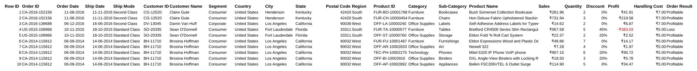
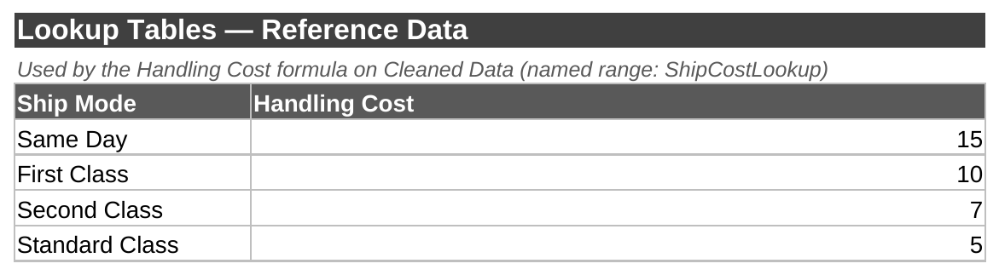
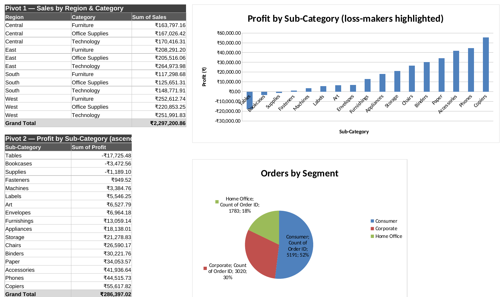
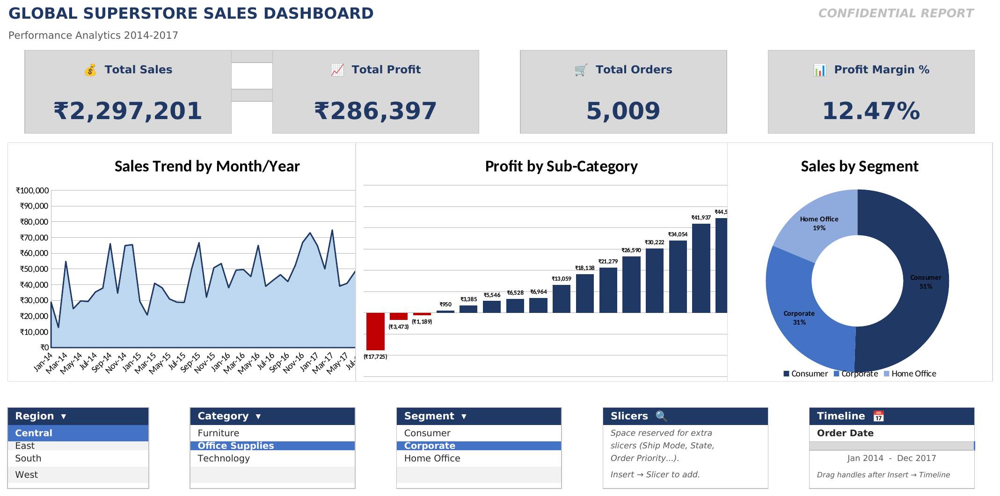
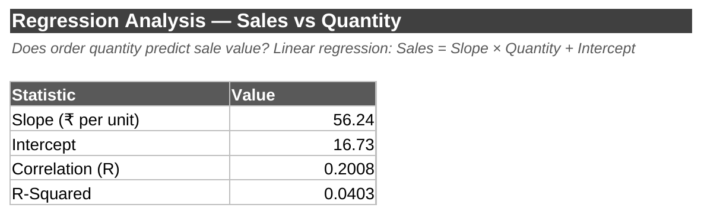
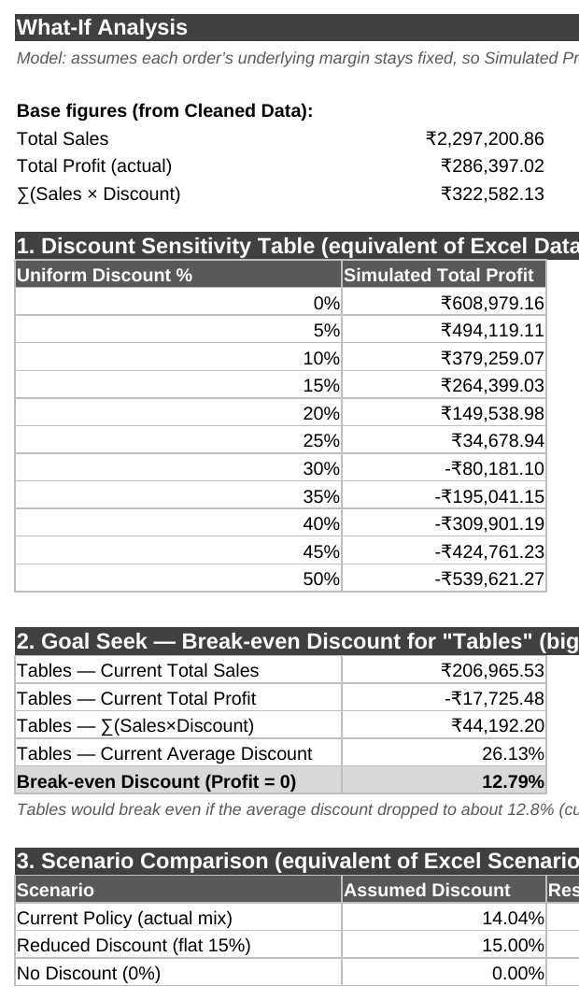

<div align="center">

# -- ! Global Superstore Sales Dashboard ! --
### *An End-To-End Excel Analytics Project: Clean → Pivot → Visualize → Model → Simulate*

[](https://www.microsoft.com/excel)
[](https://www.microsoft.com/excel)
[](https://www.microsoft.com/excel)
[](https://www.microsoft.com/excel)

<br/>

> *"9,994 orders, one workbook, and an honest answer for every question it was asked."*

</div>

---

## 📋 Table of Contents

- [📌 Overview](#-overview)
- [🎯 Problem Statement](#-problem-statement)
- [✨ Key Features](#-key-features)
- [🏗️ Project Structure](#️-project-structure)
- [🔄 Workbook Workflow](#-workbook-workflow)
- [🧹 Sheet 1–2 — Raw Data & Cleaned Data](#-sheet-12--raw-data--cleaned-data)
- [🔗 Sheet 3 — Lookup Tables](#-sheet-3--lookup-tables)
- [📊 Sheet 4 — Pivots](#-sheet-4--pivots)
- [📈 Sheet 5 — Dashboard](#-sheet-5--dashboard)
- [📉 Sheet 7 — Regression Analysis](#-sheet-7--regression-analysis)
- [🔮 Sheet 8 — What-If Analysis](#-sheet-8--what-if-analysis)
- [🛠️ Tech Stack](#️-tech-stack)
- [📈 Results & Insights](#-results--insights)
- [🏆 Advantages](#-advantages)
- [📄 License](#-license)
- [👤 Author](#-author)

---

## 📌 Overview

**Global Superstore Sales Dashboard** is a single Excel workbook that takes a raw 9,994-row sales export (the classic Superstore dataset) all the way through cleaning, lookup-based enrichment, pivot-style summarization, an executive dashboard, a linear regression model, and a full what-if simulation suite — with no external tools or add-ins, just native Excel tables and formulas.

This project is designed to:
- Practice a **real cleaning pipeline**: type coercion, stray-character removal, duplicate checks
- Use **`VLOOKUP`** to enrich every order with a handling cost based on shipping mode
- Build **pivot-style summaries** with live `SUMIFS`/`COUNTIFS` formulas instead of native PivotTables
- Design an **executive dashboard** with `SUBTOTAL`-driven KPI cards and three linked charts
- Run a **linear regression** (slope, intercept, R², correlation) and interpret the result honestly
- Build **three what-if tools**: a discount-sensitivity table, a goal-seek break-even calculation, and a scenario comparison

---

## 🎯 Problem Statement

> **Objective:** Turn a raw sales export into a decision-ready analytics workbook — answering what's selling, what's losing money, and what would happen under different discount policies.

Given 9,994 raw orders spanning 2014–2017 across regions, categories, and customer segments, the workbook must clean and validate the data, enrich it with a shipping-cost lookup, summarize it from multiple angles, present it as an at-a-glance dashboard, test whether order quantity predicts sale value, and simulate the profit impact of different discount strategies — including finding the exact discount level at which the worst-performing sub-category stops losing money.

| 📂 Sheet | 📄 Type | 🔍 Description |
|----------|---------|-----------------|
| `Raw Data` | Source of Truth | Untouched 9,994-row import, structured as `tblOrders` |
| `Cleaned Data` | Working Table | Typed, deduped, enriched — `tblOrdersClean` |
| `Lookup Tables` | Reference | Ship Mode → Handling Cost (`ShipCostLookup`) |
| `Pivots` | Summary | 4 live-formula pivot tables + matching charts |
| `Dashboard` | Executive View | 4 KPI cards + 3 linked charts, navy/gray theme |
| `Dashboard Resources` | Helper Data | Feeds every dashboard chart/card/slicer |
| `Regression Analysis` | Statistical Model | Sales vs. Quantity linear regression |
| `What-If Analysis` | Simulation | Discount sensitivity, break-even, scenario comparison |

The goal is to demonstrate that **advanced Excel analysis** — the kind normally reached for Python/SQL — can be built entirely from native formulas and stay fully auditable.

---

## ✨ Key Features

| Feature | Description |
|--------|-------------|
| 🧹 **Documented Cleaning Steps** | Dates converted to real date values, numeric columns enforced, 225 stray characters stripped from `Product Name`, duplicates checked (none found) |
| 🔗 **`VLOOKUP` Enrichment** | Every row gets a `Handling Cost` looked up from `ShipCostLookup` by `Ship Mode` |
| 🏷️ **Formula-Derived Classification** | An `Order Result` column labels each order Profitable or Loss straight from its `Profit` value |
| 📊 **Formula-Built Pivots** | Four "pivot tables" built entirely with `SUMIFS`/`COUNTIFS` — fully auditable, no black-box PivotCache |
| 📈 **Executive Dashboard** | 4 `SUBTOTAL`-based KPI cards (filter-aware) plus 3 charts: monthly trend, sub-category profit (loss-makers in red), segment donut |
| 🎛️ **Slicer-Ready Design** | Built on an Excel Table (`tblOrdersClean`) so Region/Category/Segment/Order Date slicers drop in with zero extra setup |
| 📉 **Honest Regression Reporting** | R² of 4% is reported and interpreted plainly — quantity is *not* a strong predictor of sale value, and the workbook says so |
| 🔮 **Three-Layer What-If Suite** | A full discount-sensitivity table, a goal-seek break-even discount for the worst sub-category, and a 3-scenario profit comparison |

---

## 🏗️ Project Structure

```
📦 practical/
│
├── 📄 Sales_Analysis_Project_Dashboard.xlsx   ← Full workbook (9 sheets)
├── 📄 README.md                               ← This file
│
└── 📁 assets/
    ├── 🖼️ 01_raw_data.png                     ← Raw Data sample rows (real screenshot)
    ├── 🖼️ 02_cleaned_data.png                 ← Cleaned Data sample (real screenshot)
    ├── 🖼️ 03_lookup_tables.png                ← Ship Mode → Handling Cost lookup (real screenshot)
    ├── 🖼️ 04_pivots.png                       ← Pivots 1–3 + their charts (real screenshot)
    ├── 🖼️ 05_dashboard.png                    ← Executive dashboard, full (real screenshot)
    ├── 🖼️ 06_regression_stats.png             ← Regression statistics table (real screenshot)
    └── 🖼️ 07_whatif_tables.png                ← All 3 What-If tables (real screenshot)
```

> **On the screenshots:** every image in `assets/` is a genuine screenshot of the workbook itself (rendered from the real `.xlsx`, not redrawn) — same fonts, gridlines, colors, and numbers you'd see opening the file. One caveat: two chart objects (the Pivots sheet's monthly-trend line and the Regression/What-If scatter and bar charts) reference very large ranges that the automated screenshot tool couldn't rasterize; those specific chart *pictures* are cropped out below, but their underlying data tables are shown in full, and the identical monthly-trend chart renders correctly on the Dashboard screenshot.

---

## 🔄 Workbook Workflow

```
Raw Data (9,994 rows)
      │
      ▼
┌─────────────────────────────┐
│ Cleaned Data                  │  ← types fixed, VLOOKUP handling cost,
│ (tblOrdersClean)              │     Order Result column added
└──────────────┬────────────────┘
               │
   ┌───────────┼───────────────┬──────────────┐
   ▼           ▼                ▼              ▼
Pivots     Dashboard       Regression      What-If
(4 tables  (KPI cards +    Analysis        Analysis
+ charts)   3 charts)      (Sales~Qty)     (3 tools)
```

---

## 🧹 Sheet 1–2 — Raw Data & Cleaned Data

`Raw Data` is the untouched 9,994-row import (`tblOrders`) — never edited directly, kept as a source of truth. `Cleaned Data` (`tblOrdersClean`) is the working copy: dates converted to real date values, numeric columns enforced as true numbers, 225 stray characters removed from `Product Name`, duplicates checked (none found), and two formula columns added.

!practical/assetsassets/01_raw_data.png

**Cleaned Data adds two live formula columns:**
```
Handling Cost  = VLOOKUP([Ship Mode], ShipCostLookup, 2, FALSE)
Order Result   = IF([Profit] >= 0, "Profitable", "Loss")
```



---

## 🔗 Sheet 3 — Lookup Tables

A small reference table (`ShipCostLookup`) mapping each shipping mode to a flat handling cost, referenced by the `VLOOKUP` in `Cleaned Data`.



---

## 📊 Sheet 4 — Pivots

Four summary tables, each built with live `SUMIFS`/`COUNTIFS` formulas (functioning like native PivotTables but fully transparent), each paired with a matching chart.

| # | Pivot | Chart Type | Headline Result |
|---|-------|-----------|-------------------|
| 1 | Sales by Region & Category | Grouped bar | West + East lead; Technology is the strongest category almost everywhere |
| 2 | Profit by Sub-Category (loss-makers first) | Horizontal bar | **Tables** is the biggest loss-maker at −₹17,725 |
| 3 | Orders by Segment | Pie/donut | Consumer segment accounts for 5,191 of 9,994 orders (52%) |
| 4 | Sales Trend by Month | Line | Clear year-over-year growth with a December seasonal peak |

**Pivot 1, Pivot 2, and Pivot 3 with their live charts** (Pivot 4's monthly-trend table continues below this view — its chart is identical to the one shown on the Dashboard):



---

## 📈 Sheet 5 — Dashboard

An executive-style dashboard: 4 KPI cards built with `SUBTOTAL` formulas (so they stay accurate under any slicer filter), plus 3 charts, in a navy/gray theme.



**KPI cards:**
```
Total Sales    = SUBTOTAL(109, tblOrdersClean[Sales])
Total Profit   = SUBTOTAL(109, tblOrdersClean[Profit])
Total Orders   = SUBTOTAL(103, tblOrdersClean[Order ID])
Profit Margin  = Total Profit / Total Sales
```

**Sample Output:**
```
Total Sales      ₹22,97,201
Total Profit     ₹2,86,397
Total Orders     5,009
Profit Margin    12.47%
```

> Because the dashboard is built on `tblOrdersClean`, adding slicers (Insert → Slicer on Region / Category / Segment / Order Date) makes every card and chart interactively filterable with zero extra formula work.

---

## 📉 Sheet 7 — Regression Analysis

A linear regression of `Sales` on `Quantity`, computed with `SLOPE`, `INTERCEPT`, `CORREL`, and `RSQ`, backed by a scatter chart with trendline.

```
Regression Equation:  Sales = 56.24 × Quantity + 16.73

Slope (₹ per unit)     56.24
Intercept              16.73
Correlation (R)        0.201
R-Squared              4.0%
```



> **Interpretation (as stated directly on the sheet):** R² = 4.0% — quantity explains only a small share of the variation in sales value; it is not a strong standalone predictor. This is reported as an honest finding rather than dressed up as a stronger relationship than the data supports.
>
> *(The sheet's scatter-with-trendline chart references all 9,994 orders and didn't rasterize in the automated screenshot tool — it displays correctly when the workbook is open in Excel.)*

---

## 🔮 Sheet 8 — What-If Analysis

Three what-if tools, each built as live formulas rather than Excel's Data Table/Goal Seek/Scenario Manager add-ins (so they recalculate instantly and stay fully visible):

**All three What-If tables** (discount sensitivity, break-even goal seek, and scenario comparison):



```
Model: Simulated Profit = Actual Profit + Σ(Sales×Discount) − (New Discount × ΣSales)

At 0% company-wide discount, profit roughly doubles to ₹6,08,979.
Profit turns negative once the average discount passes ~28%.
```

**2. Break-Even Discount** — for `Tables`, the biggest loss-making sub-category:
```
Tables — Current Total Sales        ₹2,06,966
Tables — Current Total Profit       −₹17,725
Tables — Current Average Discount   26.1%
Break-Even Discount (Profit = 0)    12.8%
```
> Tables would break even if its average discount dropped from ~26% to about 12.8%.

**3. Scenario Comparison:**

| Scenario | Assumed Discount | Resulting Total Profit |
|----------|------------------|--------------------------|
| Current Policy (actual mix) | 14.04% | ₹2,86,397 |
| Reduced Discount (flat 15%) | 15.00% | ₹2,64,399 |
| No Discount (0%) | 0.00% | ₹6,08,979 |

---

## 🛠️ Tech Stack

| Tool | Purpose |
|------|---------|
| 📗 **Microsoft Excel** | Entire workbook — tables, formulas, charts, no add-ins required |
| 📋 **Excel Tables** | `tblOrders` and `tblOrdersClean` for structured, formula-safe references |
| 🔗 **`VLOOKUP`** | Handling cost enrichment from the Lookup Tables sheet |
| 📊 **`SUMIFS` / `COUNTIFS`** | Formula-built pivot summaries |
| 📐 **`SUBTOTAL`** | Filter-aware KPI cards on the Dashboard |
| 📉 **`SLOPE` / `INTERCEPT` / `CORREL` / `RSQ`** | Linear regression statistics |
| 🎨 **Native Charts** | Bar, line, pie/donut, and scatter-with-trendline, all built in-sheet |

---

## 📈 Results & Insights

- ✅ **9,994 Orders Cleaned** — zero duplicates found, all types enforced, 225 stray characters removed
- 💰 **Total Sales / Profit** — ₹22,97,201 / ₹2,86,397 (12.47% margin) across 5,009 orders
- 📉 **Tables Is The Problem Child** — the single biggest loss-maker at −₹17,725, needing its average discount cut from ~26% to ~12.8% to break even
- 🏆 **Copiers Is The Star** — the most profitable sub-category at +₹55,618
- 🌍 **West & East Lead Regional Sales**, with Technology the strongest category in most regions
- 👥 **Consumer Segment Dominates** — 52% of all 9,994 orders
- 📉 **Quantity Barely Predicts Sales** — R² of just 4%, honestly reported rather than overstated
- 🔮 **Discounting Has A Clear Tipping Point** — company-wide profit turns negative once average discount exceeds ~28%

---

## 🏆 Advantages

| Advantage | Detail |
|-----------|--------|
| 🔍 **Fully Auditable** | Every "pivot" and KPI is a visible formula, not a black-box PivotCache — click any cell to see exactly how it's computed |
| 🧹 **Documented Cleaning** | The Instructions sheet states exactly what was changed and why, rather than leaving cleaning steps implicit |
| 🎛️ **Slicer-Ready Architecture** | Built on Excel Tables and `SUBTOTAL`, so interactive filtering requires zero additional formula changes |
| 📉 **Honest Statistics** | A weak R² is reported as a weak R², not spun into a stronger claim |
| 🔮 **Three Complementary What-If Tools** | Sensitivity table, goal-seek, and scenario comparison approach the same discount question from three angles |
| 🎓 **No Add-Ins Required** | Everything — including the "pivots" and "what-if" tools — is built from formulas any Excel version supports |

---

## 📄 License

This project is licensed under the **MIT License** — see the [LICENSE](LICENSE) file for full details.

```
MIT License — Free to use, modify, and distribute with attribution.
```

---

## 👤 Author

<div align="center">

### Ayush Isamaliya

[](https://github.com/isamaliya16)
[](https://www.linkedin.com/in/ayush-isamaliya-686533312/)

> *"A spreadsheet becomes an analysis the moment its numbers can explain themselves."*

**🎓 Role:** Junior Python Developer | Programming Enthusiast \
**📍 Location:** India\
**🛠️ Skills:** Excel · Formulas & Lookups · Dashboard Design · Regression · What-If Analysis

</div>

---

<div align="center">

---

*Made with ❤️ and ☕ — Last updated: 18 September, 2026*

</div>
